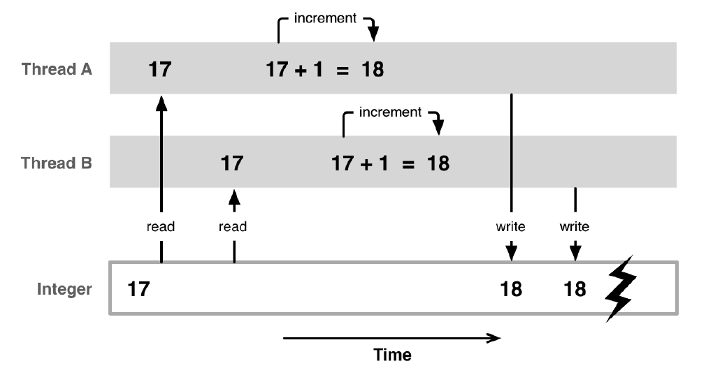

# Programowanie współbieżne - wątki w C++, semafory

## Wątki w C++11 – klasa `std::thread`

Biblioteka OpenMP sprawdza się przy *zrównleglaniu* wykonywanych operacji, jednak w wielu sytuacjach chcemy mieć ręczną kontrolę nad tym, kiedy wątki są uruchamiane, jakie realizują funkcje i kiedy są kończone - na przykład, kiedy chcemy asynchronicznie oczekiwać i reagować na zdarzenia bądź oddzielić warstwę interfejsu aplikacji od jej "rdzenia" - tak aby przetwarzanie danych mogło odbywać się w tle i nie powodowało "zawieszenia" interfejsu.

W ramach kursu wykorzystamy język C++ i mechanizmy dostarczane przez bibliotekę standardową w ramach rozszerzeń C++11. Rozszerzenia te są dostępne w większości współczesnych kompilatorów, np. w Visual Studio od wersji 2013. Niektóre środowiska/kompilatory wymagają włączenia dodatkowych opcji w celu uaktywnienia standardu C++11 (np. flaga `-std=c++11` dla kompilatora `gcc`).

Analogiczną funkcjonalność można osiągnąć za pomocą bibliotek takich *pthreads* (w systemach zgodnych z *POSIX*, np. Linux), bądź rozwiązań dedykowanych dostarczanych przez poszczególne systemy (np. wątki w *Windows API*). Istnieje też szereg języków projektowanych z myślą o przetwarzaniu współbieżnym, np. Go, Erlang, Ada.

## Pierwszy program wielowątkowy z `std::thread`

W celu wykorzystania wątków dołącz nagłówek `<thread>`. Pojedynczy wątek reprezentowany jest poprzez obiekt klasy `std::thread`. Konstruktor klasy przyjmuje wskaźnik do funkcji, która ma zostać uruchomiona w wątku oraz opcjonalnie argumenty, które mają zostać przekazane do uruchamianej funkcji:

```cpp
// tworzy wątek first wykonujący funkcję foo
std::thread first(foo);
// tworzy watek second wykonujacy funkcje bar, z argumentami
std::thread second(bar, 0, 0.2);
```

Wartość zwracana przez funkcje wykonywane w wątku (tutaj: `foo` i `bar`) jest ignorowana. W celu zwrócenia wyników z funkcji wykonywanych w wątku musimy się posłużyć zmienną globalną, polem w klasie, bądź przekazywaniem zmiennych przez wskaźnik. Przekazywanie zmiennych do wątku przez referencję jest zabronione (chyba, że skorzystamy z wrappera `std::ref()` lub `std::cref()`).

W celu poczekania na zakończenie danego wątku wywołujemy na nim metodę join():

```cpp
first.join(); // czeka na zakonczenie wykonywania wątku w obiekcie first
```

Przykładowy program uruchamiający dwa wątki może zatem wyglądać następująco:

```cpp
#include <iostream>
#include <thread>

void foo() {
    for (int i = 0; i < 5; i++) {
        std::cout << "hello foo" << std::endl;
    }
}

void bar(int x, float y) {
    for (int i = 0; i < 5; i++) {
        std::cout << "hello bar " << x << " " << y << std::endl;
    }
}

int main(int argc, const char * argv[]) {
    std::thread first(foo);
    std::thread second(bar, 0, 0.2);

    std::cerr << "threads started" << std::endl;

    // wait for threads to finish:
    first.join();
    second.join();

    std::cerr << "threads finished" << std::endl;

    return 0;
}
```

Uruchom powyższy program i przeanalizuj wyniki uzyskane w konsoli.

## Przydatne funkcje i mechanizmy

### Sprawdzenie liczby dostępnych rdzeni

Liczbę dostępnych w systemie równoległych sprzętowo wątków można sprawdzić wykorzystując funkcję `std::thread::hardware_concurrency()`. W przypadku procesorów z technologią Hyper-threading, każdy rdzeń fizyczny widziany jest w systemie jako dwa rdzenie logiczne, stąd np. dla 2-rdzeniowego procesora funkcja może zwrócić wartość 4.

**Uwaga!** Jeżeli dany system operacyjny nie oferuje możliwości sprawdzenia liczby równoległych wątków, funkcja zwróci 0. Poprawnie napisany program powinien uwzględniać tę ewentualność.

Pamiętaj, że tworzenie wątków i przełączanie kontekstu pomiędzy nimi (wywłaszczanie) to operacja zajmująca czas procesora, zatem tworzenie zbyt wielu wątków (więcej niż dostępnych sprzętowo), lub wątków działających zbyt krótko, może się okazać nieopłacalne.

### Wstrzymywanie wątku (sleep)

Wstrzymanie wątku (również w standardowym programie jednowątkowym) możliwe jest dzięki funkcji `std::this_thread::sleep_for(std::chrono::duration sleep_duration)`. Obiekt typu `std::chrono::duration` reprezentujący czas wstrzymania można stworzyć dzięki typom pomocniczym, takim jak `std::chrono::milliseconds` lub `std::chrono::seconds`, na przykład:

```cpp
// pausing current thread for 500 milliseconds
std::this_thread::sleep_for(std::chrono::milliseconds(500));
```

### Wyrażenia lambda

Kiedy nie chcemy deklarować nowej funkcji tylko po to, żeby na przykład uruchomić fragment kodu w wątku, możemy wykorzystać wyrażenia lambda. Wyrażenia lambda działają jak funkcje definiowane w miejscu, w którym chcemy ich użyć. Zamiast wskaźnika do funkcji (nazwy), którą chcielibyśmy uruchomić w wątku, wpisujemy kod:

```cpp
[](){ /* cialo lambdy */ }
```

Przykładowe wykorzystanie wyrażenia lambda wygląda następująco:

```cpp
std::thread watek1([](){ std::cout << "kod w watku" << std::endl; });
```
Jeśli chcemy, aby kod wewnątrz wyrażenia lambda miał dostęp do zewnętrznych zmiennych, możemy podać ich nazwy w tzw. *capture-list* w nawiasach kwadratowych, oddzielone przecinkami:

```cpp
int zmienna = 5;
std::thread watek2([zmienna](){
    std::cout << "kod w watku, zmienna = " << zmienna << std::endl;
});
```

Jeśli chcemy modyfikować zewnętrzne zmienne z poziomu wyrażenia lambda, musimy przekazać je przez referencję:

```cpp
int zmienna2 = -1;
std::thread watek3([&zmienna2](){
    zmienna2 = 10;
});
```

### Pomiar czasu

W celu określenia czy wprowadzane przez nas rozwiązania przekładają się na zysk w wydajności możemy wykorzystać funkcje pomiaru czasu dostarczone w bibliotece `<chrono>`. W pierwszym przykładzie funkcje biblioteki `chrono` zostały wykorzystane do pomiaru czasu, jaki upłynął między dwoma miejscami w kodzie.

Poniżej zaprezentowano wyodrębniony fragment kodu realizujacy pomiar czasu, opatrzony dodatkowymi komentarzami:

```cpp
// deklarujemy obiekty przechowujace moment rozpoczecia i zakonczenia
std::chrono::time_point<std::chrono::system_clock> start, end;
// zapisujemy biezacy czas jako moment rozpoczecia
start = std::chrono::system_clock::now();

/*
kod, ktorego wydajnosc badamy
*/

// zapisujemy biezacy czas jako moment zakonczenia
end = std::chrono::system_clock::now();
// obliczamy roznice
std::chrono::duration<double> elapsed_time = end - start;
// wypisanie czasu w sekundach
std::cerr << "czas: " << elapsed_time.count() << std::endl;
```

Pamiętaj, że program uzyska zupełnie różne wyniki w zależności od optymalizacji podczas kompilacji (wybór konfiguracji *Debug* lub *Release*) oraz sposobu uruchomienia - zwykłego lub w trybie debugowania. Porównując wyniki należy uruchamiać tę samą konfigurację, w ten sam sposób.


### ❗️Zadanie 1.❗️ - kolekcja wątków

Zmodyfikuj pierwszy przykład tak, aby uruchamiał podaną przez użytkownika liczbę wątków, wykonujących jedną funkcję. Funkcja ma wyświetlić w konsoli wiadomość zawierającą unikalne *ID* wątku. *ID* można pobrać z poziomu wątku dzięki funkcji `std::this_thread::get_id()`. Zastanów się jak możesz wygodnie przechowywać informacje o kolekcji wątków i czekać na zakończenie wszystkich.

**Uwaga!** obiekt `std::thread` nie jest kopiowalny (nie jest *CopyConstructible* ani *CopyAssignable*), co oznacza, że nie można w trywialny sposób najpierw utworzyć tymczasowego obiektu, a następnie umieścić go w kolekcji np. metodą `push_back`).

Dlatego też możemy tworząc wątek od razu umieszczać go w kolekcji:

```cpp
collection.push_back(std::thread(foo));
```

lub wymusić przeniesienie korzystając z narzędzia `std::move` i metod typu `emplace`:

```cpp
std::thread temporary(foo);
collection.emplace_back(std::move(temporary));
```

Można również pozwolić metodzie  `emplace_back` na utworzenie obiektu typu `std::thread` za nas, przekazując jedynie argumenty jego konstruktora:
```cpp
collection.emplace_back(foo);
```


### ❗️Zadanie 2.❗️ - szukanie liczb pierwszych

> Liczby pierwsze często znajdują się w okolicy zbioru *2<sup>n</sup> - 1*, gdzie n ∈ N

Napisz program, który wykorzystując tę własność, będzie wyszukiwał liczby pierwsze. W tym celu wygeneruj wektor - serię wartości należących do powyższego zbioru, dla *n* od 2 do 63. Wykorzystaj typ liczbowy `uint64_t` aby zapewnić, że liczby da się poprawnie zapisać w zmiennej.

Następnie napisz funkcję, która rozpoczynając od przekazanej do niej pojedynczej liczby, będzie przeszukiwała zbiór liczb naturalnych w kierunku malejącym, aż do napotkania liczby pierwszej:

```cpp
uint64_t prime = find_prime_from(63); // zwroci 61
```

Przetestuj działanie funkcji dla liczb nieco większych od znanych sobie liczb pierwszych, aby zweryfikować poprawność jej implementacji.

Następnie wywołaj funkcję dla każdego elementu z uprzednio przygotowanego zbioru wartości początkowych, a wyniki umieszczaj w odpowiednim miejscu w uprzednio przygotowanym wektorze.

Przenieś obliczenia do wielu wątków z wykorzystaniem `std::thread`. Zastanów się jak uzyskać wartość zwróconą przez funkcję `find_prime_from` uruchomioną w wątku. W razie konieczności użyj funkcji lambda lub funkcji pośredniczącej w wywołaniu.

* Wersja podstawowa: uruchom tyle wątków, ile jest liczb do znalezienia

* Wersja zaawansowana: postaraj się samodzielnie podzielić pracę w zależności od liczby rdzeni dostępnych w komputerze (patrz: [**Przydatne funkcje**](#przydatne-funkcje-i-mechanizmy) powyżej).

Dodaj do programu funkcje pomiaru czasu i porównaj wynik działania na jednym wątku oraz wersji wielowątkowej. Czy widoczny jest przyrost wydajności?

## Problemy równoległego dostępu do zasobów (sytuacja wyścigu, wyścig danych)

W programach wielowątkowych dane mogą być współdzielone pomiędzy wątkami. Równoległa praca wielu wątków, które operują na wspólnych danych może prowadzić do nieoczekiwanych rezultatów. Należy pamiętać, że wątki mogą zostać wywłaszczane w dowolnych momentach, co bez odpowiednich zabezpieczeń może spowodować, że dane będące w trakcie modyfikacji przez jeden wątek zostaną błędnie wykorzystane lub nadpisane przez inny.

### ❗️Zadanie 3.❗️ - licznik

Stwórz w programie zmienną całkowitą. Utwórz 1000 wątków, z których każdy odczeka 10 milisekund, a następnie zwiększy wartość stworzonej zmiennej o 100. Poczekaj na zakończenie wszystkich wątków i sprawdź wynik dodawania. Uruchom program kilkukrotnie.

Czy wynik jest powtarzalny i zgodny ze spodziewanym? Zastanów się jakie operacje elementarne musi wykonać komputer, aby zwiększyć wartość zmiennej zapisanej w pamięci o daną wielkość. Przeanalizuj sytuację, kiedy sekwencja tych operacji zostanie przerwana przez inny wątek.



Jak pewnie zauważysz taki program sprawdziłby się lepiej jako generator losowych wartości, ponieważ wyniki nie są powtarzalne ani przewidywalne. Taka niepożadana sytuacja, kiedy wynik zależy od kolejności lub czasu wystąpienia zadania nazywana jest wyścigiem (and. *race condition*, *hazard*). Jest to błąd semantyczny, czyli można wykryć go już w momencie kompilacji. Standard C++ definiuje też pojęcie wyścigu danych (ang. *data race*), czyli szczególnej formy sytuacji wyścigu, która ma miejsce w wyniku jednoczesnej modyfikacji jednego obiektu. Oba problemy mogą występować jednocześnie. W poniższym przykładzie ma miejsce przerwanie wykonywania operacji wątku oraz jednoczesny dostęp do współdzielonnej zmiennej, dając w efekcie nieprzewidywalny wynik. 

```cpp
Return value: 94800. The result shoudl be 100000
Return value: 96400. The result shoudl be 100000
Return value: 94300. The result shoudl be 100000
```

Program napisany w powyższy sposób **pomija** dwie istotne cechy zapewniające bezpieczeństwo w programowaniu współbieżnym:

* Atomowość operacji, czyli niepodzielność. Żaden inny wątek nie może zobaczyć pośredniego stanu operacji atomowej (brak możliwości zakłócenia takiej operacji). Inkrementacja nie jest operacją atomową. W C++ atomowość zapewnia biblioteka [std::atomic](https://en.cppreference.com/w/cpp/atomic).
* Synchronizacja operacji (semafory i muteksy), czyli kontrolowany dostęp do zmiennych współdzielonych.

## Semafory, muteksy, operacje atomowe

Aby zapobiec podobnym sytuacjom, w programach, gdzie zasoby są współdzielone pomiędzy wiele wątków, wprowadza się sekcje krytyczne. Sekcja krytyczna to fragment programu, w którym odbywa się dostęp do zasobów współdzielonych, i który nie może być wykonywany przez więcej niż jeden proces jednocześnie.

Dostęp do sekcji krytycznych może być kontrolowany przez *semafory*, czyli specjalne zmienne lub typy danych, które regulują dostęp do wspólnych zasobów. Semafor może być licznikiem, który określa liczbę wolnych zasobów, jakie mogą zostać rozdysponowane procesom. Można to rozpatrywać przez analogię do restauracji, gdzie zasoby to stoliki, a klienci to procesy. Początkowo semafor ma wartość równą liczbie stolików w restauracji. Każde nadejście klienta (procesu) powoduje przydzielenie mu stolika (zasobów) i zmiejszenie wartości semafora o 1. Osiągnięcie przez semafor wartości 0 oznacza, że wszystkie zasoby są zajęte, a procesy muszą oczekiwać w kolejce na obsłużenie. Kiedy proces zakończy pracę i zwalnia zasoby, wartość semafora jest inkrementowana.

Szczególnym, często używanym przypadkiem semafora jest semafor binarny, zwany też *muteksem*. Przyjmuje on wartości 0 i 1 i używamy go w sytuacji, kiedy do danych zasobów dostęp może mieć tylko jeden proces. Przed wejściem do sekcji krytycznej wątek powinien sprawdzić czy inny proces nie „przejął” muteksu, ewentualnie poczekać na jego zwolnienie (lub wykonywać inne działania nie wymagające dostępu do zasobów współdzielonych), a następnie zablokować muteks na czas wykonywania sekcji krytycznej.

Aby nie spowalniać niepotrzebnie programu poprzez zmuszanie wątków do oczekiwania na dostęp do zasobów, należy dbać o to, aby sekcje krytyczne były możliwie krótkie.

Operacja sprawdzania i blokowania muteksu musi być operacją atomową, czyli jej wykonywanie nie może być przerwane przez inny wątek. Z tego względu muteks musi być obsługiwany na poziomie systemu operacyjnego i uwzględniany przez *scheduler*, który przełącza kontekst pomiędzy procesami.

## Muteksy w C++

Muteksy w C++ dostępne są pod postacią klasy `std::mutex`, dostępnej po załączeniu nagłówka `<mutex>`.

Na obiekcie mutex możemy wykonać trzy metody:
* `lock()`: blokuje muteks; jeśli jest już zablokowany, to czeka na odblokowanie
* `trylock()`: próbuje zablokować muteks, zwraca true jeśli blokada się powiodła
* `unlock()`: odblokowuje muteks

Przykładowo, jeśli wiele wątków ma pracować na zmiennej `counter`:

```cpp
int result = do_stuff();
counter_mtx.lock();
counter += result();
counter_mtx.unlock();
```

Pamiętaj, że aby blokada miała sens, muteks - zmienna `counter_mtx` również musi być współdzielona przez wątki.

### ❗️Zadanie 4.❗️ - prosty muteks

Zastanów się, które operacje w **Zadaniu 3** powinny należeć do sekcji krytycznej. Stwórz muteks, który będzie odpowiadał za kontrolę dostępu do zwiększanej zmiennej. Zmodyfikuj program tak, aby działał poprawnie.

***
Autor: *Jakub Tomczyński*
