# Xubuntu Linux installation and configuration in the VirtualBox Environment

## GNU / Linux Systems

Linux is, in fact, a name for a free, open, UNIX-like system kernel. However, it's a common name for the whole family of systems based on this kernel. The kernel itself isn't a full, usable operating system, therefore the Linux kernel combined with a set of libraries and tools from the GNU project creates the correct name for the family of operating systems: GNU/Linux.

Linux-based operating systems are delivered as distributions such a Ubuntu, Debian or Fedora. Every distribution consists of the Linux kernel and set of software packages, selected and chosen by the creator of the distribution.

During the classes, we will be using the **Xubuntu** distribution, version **18.04 LTS**, which is a side-version of the most popular desktop Linux distribution - Ubuntu. However, the *X* means that this system is equipped with a lightweight XFCE graphical environment, which is especially suitable for the virtualization and a bit older and slower machines.

Most of the operations and commands used during the classes are very versatile and will work with any other Linux distro (exceptions will be marked).

## Virtual Machines

To make the introduction to the Linux OS easier, we will install the distro on the virtual machine (VM).

By creating the virtual machine, out computer will "simulate" all the resources creating the PC - mainboard chipset, hard drives, graphics card, network interfaces etc. Virtualization is not the same thing as emulation - in contrary to the emulation, the guest system will be provided with almost direct access to the physical CPU.

Thanks to the virtualization, we will avoid the risk of damaging the main operating system on our PC, deleting files or removing the partitions. In addition, we will be able to run not only the main system (*host*), but also one or many virtual systems (*guests*).

In order to manage and run virtual machines, we need the *hypervisor* software. During the classes, we will use the *VirtualBox* project, which supports a majority of most popular operating systems both as host or guests (Windows, macOS, numerous Linux distros etc.).

## Installing the VirtualBox

*  Download from the webpage https://www.virtualbox.org/wiki/Downloads:
    * from section **VirtualBox platform packages** -  the installation file for the **host** OS (in case of laboratory computers - Windows 10)
    * from section **VirtualBox Oracle VM VirtualBox Extension Pack** - the add-on pack (one file for all platforms) 

* Install the software with default settings.
    * The Windows OS will ask for permission to install network interface - agree.

* Install the add-on pack by opening the *vbox-extpack* extension file with the **VirtualBox Manager** application and follow the screen commands.

## Creating the virtual machine

Start the VirtualBox.

Click the *New* button. In the next steps of the creator:

* Input the name of the Virtual Machine (any name will do, it's a good idea to name the machine according to its type). During the classes, type in the name *Xubuntu 18.04 ACR*. This is your virtual machine to be used during the following classes.
* Choose the type of operating system and its architecture - Linux / Ubuntu 64-bit.

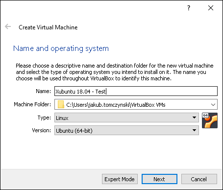

* Set the size of memory available for the VM. Please keep in mind, that the host and the guest system share the same RAM. During the classes, set this parameter to *1024 MB*.

* Create a new disk image for the VM, leave the default settings:
    * VDI format
    * Dynamic space allocation
    * Maximum size of 10GB
    * Disk image saved in *\~/Virtualbox VMs/\<VM name\>*

The configuration with the default, system-targeted settings will be created:

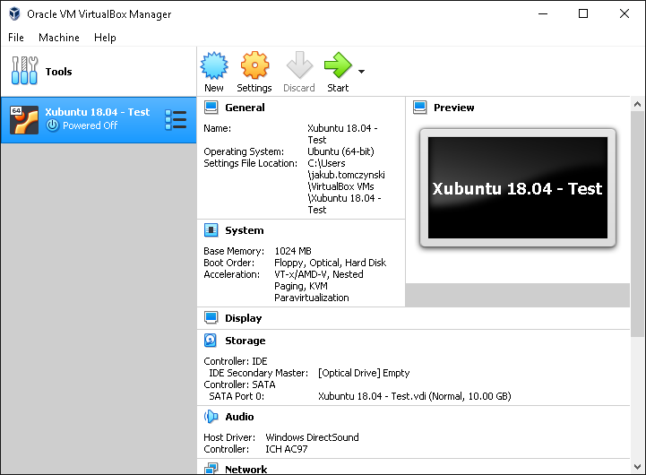

## Installing the operation system

* Download the *ISO* image from the website https://xubuntu.org/download/ - version 18.04.\*, *Desktop* for the 64-bit architecture - choose the server (*mirror*) located close to you and then - the correct ISO file (*xubuntu-18.04.2-desktop-amd64.iso*).

* Run your VM by clicking *Start*. The machine is set to boot from the virtual CD drive by default. During the first run, the VM will ask to select the location of ISO file:

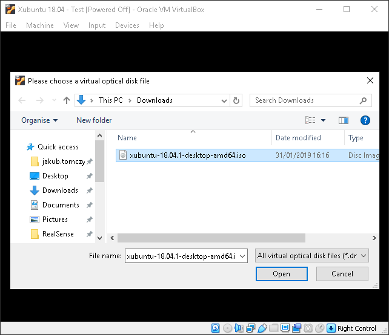

| Hint: working with the virtual machine |
| ------------- |
| When the virtual machine window is active, all the keys pressed are transferred to the guest OS. Mouse clicks within the VM area will cause capturing the cursor as well. To release the mouse cursor and disable the capturing, you have to press the *host key*. Currently set host key is displayed in the bottom-right corner of the VM's window. By default, it is a right *Ctrl* key.|

* The downloaded image is a *Live-CD*, which means, that the system can be run directly out of the CD, without the need of full installation. During the class, we are going to use the full system installation, therefore choose *Install Xubuntu* with the default English as a system language and keyboard layout. Next, click *Continue*.

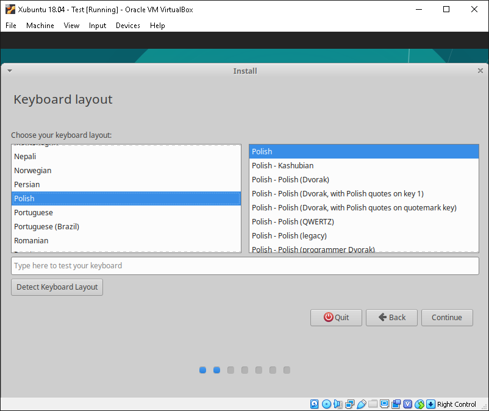

* Leave all the settings as defaults, move through the steps of installation with the *Continue* button.

    * Installation type
    
        During installation of the Linux OS on the VM, you can safely choose *Erase disk and install Xubuntu*. This option will erase the entire disk content but the virtualized system can only access a virtual disk image. If you want to install the Linux OS on the physical machine, it is possible to assign only a part of the disk for Linux and use two different systems selected with the *bootloader*.

        **IMPORTANT: Before installing any OS on the physical PC, always backup your data.

* Input user data and computer name.

    For the classes, set the login to *student* with a password *Over9000*.
    Type in the following computer name: *vbox-xubuntu-labrtos*.

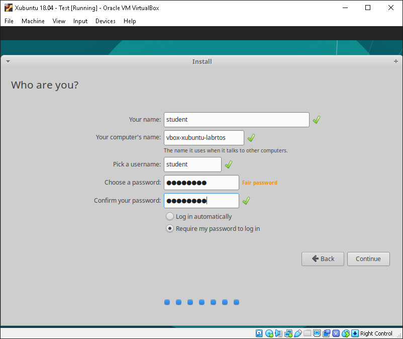

* After you finish the installation, apply the request to restart the machine.  The installer will ask you to remove the disc from the drive (VirtualBox will do it automatically), which you can confirm by pressing *Enter*. After restarting, you will be greeted with a graphical user interface. Log in by entering the password used during installation.

| The power management under Windows 10 |
| ------------- |
| In the case of a battery-powered laptop, Windows 10 may significantly limit the performance of the VM in order to extend the battery life. If your virtual machine seems to have unexpectedly low performance, try changing the current power profile by clicking on the battery icon in the Windows taskbar. |

## Installing the compiler and guest system add-ons

Right after installation of the guest system, VirtualBox must fully simulate some hardware devices. Performance and convenience of the virtual machine can be improved by installing so-called guest add-ons (*Guest Additions*).

* For Windows-based guest systems, starting from NT version onwards, the add-ons are provided in the form of a graphical installer.
    
* For Linux-based guest systems, in order to achieve full functionality, the installer has to compile a so-called *kernel modules* (drivers) dedicated to virtualized hardware and system, which will require the installation of a compiler.
  
#### Compiler installation and first steps in the terminal
    
* Programs and libraries for many distributions are delivered in the form of *packages*, which are managed by the package manager used in a given distribution. This manager automatically solves *dependencies* between packages (a program may require another program or specific libraries to work), downloads them from *repositories* and installs them in the system.

    * Contemporary distributions also often provide graphical *online store* with popular utility applications.
    
* Debian systems (including Ubuntu and derivatives) use the *APT* (*Advanced Packaging Tool*) package manager. Packages are stored in *.deb* archives. The *APT* functions are available from the command line under the `apt` command line.

Start the *Terminal Emulator* application using the Xubuntu menu icon in the top left corner. If it does not appear in the list, you can type in the search engine \"terminal\". The following window should appear:

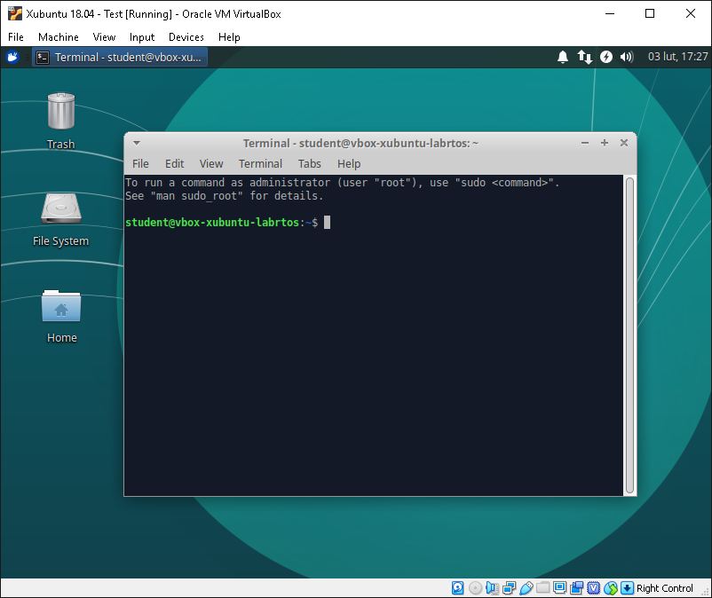

The command line contains, among other things, your username and computer name, and a * prompt* ($) at the end. After the prompt, you can type commands to execute and apply them with *Enter*.

Check if your machine is connected to the Internet by asking a known server. The default configuration of VirtualBox should provide access to the connection from the host to the guest. Type the `ping` command with the address you want to ask.

```bash
ping www.google.com
```

The terminal should show a response from the server every second.

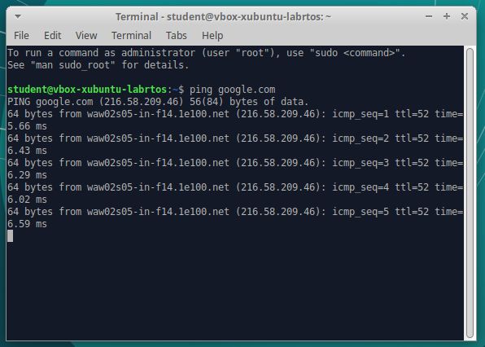

You can interrupt console programs with the *control-c* hotkey. Remember that the right control is configured as a special *host key*, so use the left control key for shortcuts. Abort the `ping` command.

Try installing the `build-essential` package, which will install the compiler and all the necessary tools. Follow the command:

```bash
apt install build-essential
```

The command will respond with a message about the lack of required permissions. Add a `sudo` command at the beginning of the command, which means simply *start as an administrator*:

```bash
sudo apt install build-essential
```

The `sudo` command will ask for a password - enter your user password provided during installation. The Manager will display a list of packages that will be installed as dependencies and will ask for confirmation. The default answer is marked with a capital letter (*Y*), confirm the installation by pressing *Enter*.

#### Installation of add-ons

Select *Devices* &rarr; *Insert Guest Additions CD image* from the menu in the VM window. Xubuntu should automatically open the file browser window. Pay attention to the path of the disc contents.

Return to the terminal window and run the `autorun.sh` command from the CD. Because the program is on the disc, enter the full path to the command, changing the version number of the add-ons to the given one:

```bash
/media/student/VBox_GAs_6.0.4/autorun.sh
```
The installer will ask for the user's password again and then display an additional terminal window with messages. After installation, the window should look like this:

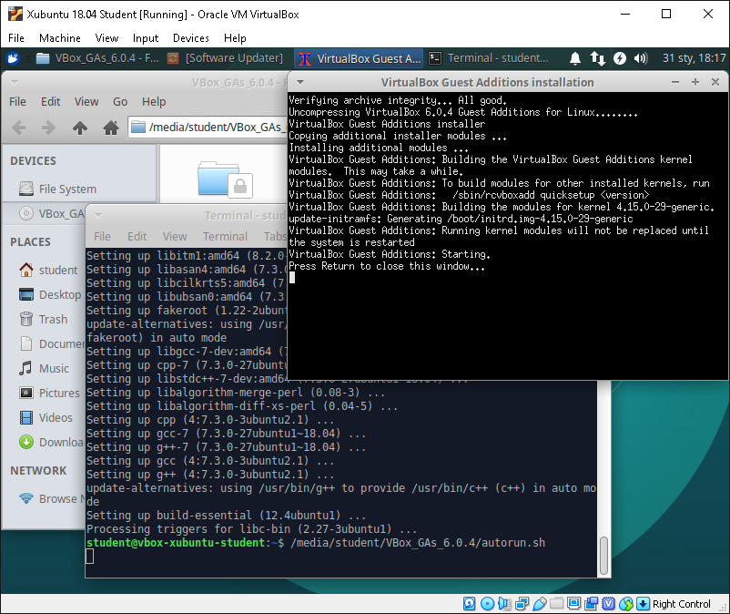

You can close the teminals and then remove the add-on disc from the virtual drive using the icon in the lower right corner. You may need to force removal of the disc (*Force Unmount*):

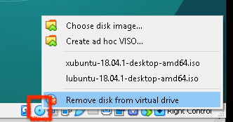

Restart your virtual machine using the Xubuntu menu:

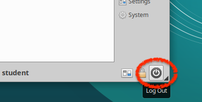

After restarting, enable the shared clipboard in the VirtualBox menu: *Devices* &rarr; *Shared Clipboard* &rarr; *Bidirectional*. This feature makes it much easier for you to transfer information between the guest and the host. From now on, the resolution of the guest system will also adjust to the size of the VirtualBox window. You can switch to full screen by pressing *host button*+*F*.

## Snapshot mechanism in VirtualBox environment

Many virtualization environments, including VirtualBox, allow you to create *snapshot* of virtual machines - saved machine states, such as machine settings, disk contents and operating memory. This allows, for example, to safely test solutions with the ability to return to the saved state. It is also possible to remember the state of a running machine, which allows, for example, to resume its operation from a selected moment.

#### Test the creation of snapshots

Turn off the virtual machine created in the previous points. Create a snapshot of the "clean" installation - a freshly installed system with guest add-ons:

* Switch the option view to *Snapshots* by highlighting the selected machine and clicking the drop-down menu:

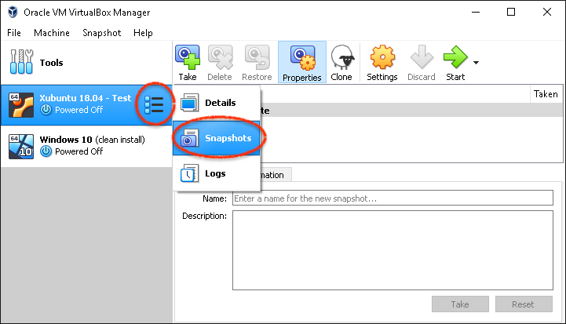

* Create a new snapshot with buttom *Take*.

    * Type in name *clean install*.

Snapshot is displayed in the form of a tree - the machine may have several shutters, the shutters may also depend on others:

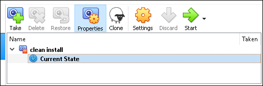

The situation presented above means that the current state and all changes found in it will be saved to the *clean install* shutter. Moreover, only the actual changes to the disk are stored in the shutter - having multiple snapshots does not necessarily mean that they take up a lot of disk space.

Start your virtual machine and make minor changes to your system - e.g. change wallpaper, create a text document on your desktop, remove the *Videos* folder from your home directory.

Turn off the guest's system, and then restore the previously saved system by selecting the *clean install* shutter and click *Restore*. VirtualBox will ask you if you want to save the changes you have made since the *clean install* snapshot was created as a new snapshot - disable this option by deactivating the *Create a snapshot of the current machine state* checkbox:

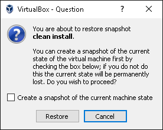

Check if the restoration has been successful - once the machine has been started there should be no changes you have made since the shutter was taken.

In addition to restoring the machine, you have the option to:

* Delete*: remove the shutter 
* Clone*: creation of a new machine based on the shutter

Leave the *clean install* shutter on the computer in the class so you can always return to the working system.

## Get to know the new system!

We'll return to the terminal's commands in the next classes, and for now - get to know the new system from a more user-friendly, graphical page!

Start the file browser, check which applications and options are available in the menu. Have a look at the settings, experiment. It's just a virtual machine, which you can always easily restore to a working snapshot or configure from scratch without worrying about messing with the host system.

***
Author: *Jakub Tomczyński*

English translation: *Adam Bondyra*

Last rev.: 25-02-2019
