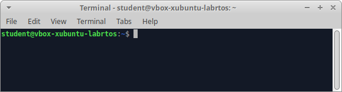
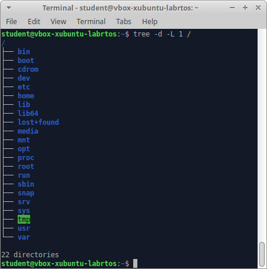
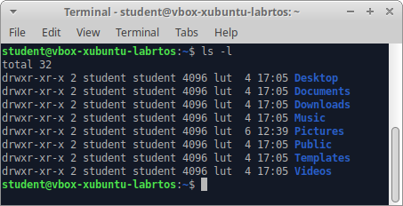

# Introduction to the command line

## Signing in

During this exercise we will learn the basics of working with Linux using the most popular and default *bash* shell. To access the shell, run the *Terminal Emulator* application from the start menu of the graphical interface of the system.



When the terminal is started, a command line is displayed with the user name (*student*), the machine name (*vbox-xubuntu-labrtos*) and the $ prompt. This means that the logged in user is a regular user. In a linux system, there is always one privileged *root* user with full administrative rights to the system. In such case, the prompt changes to # and the username to *root*. After the prompt, you can enter commands and confirm them with the *Enter* key.

After logging into the system, the user has the possibility to change his own password with the command:
```bash
passwd
```
After giving the command, you should enter the existing password, and then the new password, which must also be repeated in order for the system to verify whether an error has not been made when entering it (e.g. "typos"). For security reasons, no characters are displayed on the monitor while entering the password. The system identifies users on the basis of special numerical identifiers (such numbers are easier to process) - called **id**. Each user of the operating system can also check which numeric identifier **id** has been assigned with the command:
```bash
id
```
the result of which may be as follows:
```bash
uid=1000(student) gid=1000(student) groups=1000(student),4(adm),24(cdrom)....
```
where *uid* (*user identifier*) means user identifier, its name is in brackets, *gid* (*group identifier*) means group identifier - each user belongs to a certain group, the so-called basic group (for the above example it is a group with 1000 identifier and student name), additionally each user can belong to different groups, they are listed after the word *groups*.

Multi-accessibility means that each user can log on to the system several times, e.g. using virtual terminals accessible by means of Ctrl-Alt-F1, Ctrl-Alt-F2 keys, etc.  By default, the graphical environment is available under the terminal *tty7* (Ctrl-Alt-F7). It is also possible to obtain information about all users currently logged into the system - to do this you need to issue a command:
```bash
who
```
To log out of the system, you must issue a command:
```bash
exit
```
In the case of a graphical application *Terminal Emulator*, this will result in the termination of its operation. When working in text mode, directly in the *bash* shell, the *exit* command causes the user to log out of the terminal session.

## Issuing commands

Commands in Linux can be given with **arguments** and **switches** according to the template:
```bash
command [switches] [arguments]
```
Here is an example:
```bash
ls -al /etc
```
In this case, the `ls` command has been run with the `/etc` argument and the `al` switches. Issuing the `ls` command without an argument will display the contents of the current directory. Providing the directory name as an argument will display the contents of the indicated directory - in the example, the directory `/etc`. Next, the default operation of the command can be modified using switches, which are usually one-character abbreviations always following the "-" character. The example uses two switches:  `a` and `l`. A description of the possible arguments and switches can be found in the system help for the appropriate command. Switches, as you can see, can be combined - the next example shows how to issue a command with switches:
```bash
ls -a -l /etc
```
```bash
ls -l -a /etc
```
```bash
ls -al /etc
```
```bash
ls -la /etc
```
Each of the commands shown above is equivalent and results in the same operation. Multi-character switches are specified using the "--" sequence.

***
## Tips and tricks:

In order to work effectively with the terminal, it is worth getting to know a few useful "tricks": 
* While typing commands, access paths, etc., pressing the `TAB` key makes terminal  complete the following part of the command 
* By pressing the up/down arrow keys while working with the command line, you can easily cycle between the past commands given in this session.
* Press `Ctrl+R` and search for the corresponding command to access more extended command history.
* The `clear` command clears the terminal screen 
* Entering `!!` automatically replaces the most recently issued command. For example, if you forget to execute a complex command with *root* user privileges, just type `sudo !!` in the next step.  
* To issue multiple commands in one line, you can separate them with `&&` or `;` characters. In the first case, subsequent commands will only be executed if the previous command suceeded. Separation by a semicolon causes sequential execution of commands without regard to the result of the operation.
 ***

## System help
In Linux, each command has a system help that describes different aspects and applications of the tool and the available switches. One of the mechanisms for displaying help files is to call a command with a `--help` switch, e.g. `--help`:
```bash
ls --help
```
displays a usage of all switches, references to an external document and other useful information concerning the `ls` command.

More extensive documentation of commands can be obtained by calling:
```bash
man command_name
```
This command launches an interactive help file browser for the given program or service.
System help is displayed with a `more` browser, which can be operated with following keyboard commands:

* space - go to the next page;
* Ctrl+B - go to the previous page;
* q - close and leave the browser;
* / - forward text search, after the character / enter the text to be searched;
* ? - backward search;
* n, N - move to the next (n)/ previous (N) occurrence of the search term.

## Structure of the filesystem

A directory is a structure that allows you to organize and group the data that is stored on your computer's disk. Directories have a hierarchical structure - both files and lower-level directories can be stored in each directory. In UNIX systems, all available file systems are perceived by the user as a single directory structure, with the so-called, top-level root directory, marked with the `/` symbol. If several filesystems are available, one filesystem is the master system and the others are mounted inside. Each user has a so-called home directory, usually a subdirectory of the `home` directory, where the user can store his own files.



The form of the UNIX file system is largely standardised - these are the most important subdirectories of the root directory:

* `/bin` - a directory containing the programs necessary to run the system;
* `/dev` - a directory containing special files that represent the available devices;
* `/etc` - a directory with system configuration files;
* `/home` - this directory contains the home subdirectories of system users;
* `/proc` - a virtual filesystem that provides information about current processes in the system and its kernel;
* `/root` - usually the home directory of the superuser *//root///* - the system administrator;
* `/usr` - a directory containing a set of application software available to users;
* `/var` - this directory contains files that often change their content and/or size.

A more detailed description of the structure of the system directories is available in the `hier(7)` system help - to access it, you must issue a command:

```bash
man 7 hier
```

Information about the current directory is displayed after the command is issued:

```bash
pwd
```

As mentioned, the `/` symbol indicates the root directory, other symbols are also used to identify selected directories:

* `.` - indicates the current directory,
* `..` - indicates the direct parent directory;
* `~` - stands for the user's home directory.


## Handling the directories

You can perform basic directory operations using the following commands:

* `cd [switches] directory_name` - change directory, e.g.:
  * `cd /etc` - changes the current directory to the `/etc` directory;
  * `cd ~` - changes the current directory to the user's home directory;
  * `cd ..` - changes the current directory to the direct parent directory.
* `ls [switches] [directory_name]` - displays the contents of the directory, e.g.:
  * `ls` - displays the contents of the current directory;
  * `ls -a` - displays the contents of the current directory including all files - i.e. ones with the name starting with the `.` character - hidden files;
  * `ls -l` - displays all files in the current directory, displaying the so-called "long format", i.e. giving the type of each object in the directory (the first line character: `d` - directory, character `-` - regular file, `l` - link), access rights, number of links, owner, group name, size (in bytes), date of last modification and name (see figure below).
  
    
  * `ls -al ~` - as above, displaying the contents of the home directory including hidden files;
  * `ls -al /etc` - as above, but the contents of the `/etc` directory are displayed.
* `mkdir [switches] directory_name` - creating directories, e.g.:
  * `mkdir ./xyz` - Create a directory `xyz` in the current directory;
  * `mkdir ../xyz` - Create a `xyz` directory in the direct parent directory.
* `rmdir [switches] directory_name` - delete directories, e.g.:
  * `rmdir ~/xyz` - remove the `xyz` directory from the home directory;
  * `rmdir ./xyz` - remove the `xyz` directory from the current directory.

## File operations

A file is a defined (usually user-defined) portion of data that is stored in the system in the mass memory. In UNIX systems almost everything is a file, also devices are represented by special files. This allows you to maintain a consistent way of accessing and handling multiple heterogeneous resources in one transparent way. File names are not divided into name and extension, but this approach can be used; it is possible to use special characters in file names (e.g.: `$`, `%` or `#`), but this is not recommended.

You can perform basic file operations using the following commands:


* `cp [switches] file name new_name_name_or_directory` - Copy the file specified by the first argument under the name or to the directory specified by the second argument, e.g.:
  * `cp abc.txt xyz.txt` - copies the `abc.txt` file under a new name `xyz.txt` in the current directory;
  * `cp /tmp/abc.txt ~` - Copies the `abc.txt` file from the `tmp` directory to the user's home directory;
  * `cp abc.txt ~/xyz.txt` - Copies the `abc.txt` file from the current directory to the new `xyz.txt` name in the user's home directory.
  
A useful switch for the `cp` command is the `-r` switch, which is used to copy entire directory structures.

* `rm [switches] list_files` - Deleting files given as call arguments, e.g.:
  * `rm abc.txt xyz.txt` - Deletes the `abc.txt` and `xyz.txt` files in the current directory;
  * `rm /tmp/abc.txt` - Deletes the `abc.txt` file from the `/tmp` directory;

A useful switch for the `rm` command is the `-r` switch, which is used to remove entire directory structures.

* `mv [switches] file name new_name` - renaming the file specified by the first invocation argument to the name specified by the second invocation argument. If the second invocation argument is a directory, then the file will be moved to that directory, e.g.:
  * `mv abc.txt xyz.txt` - renaming the `abc.txt` file to `xyz.txt` in the current directory;
  * `mv /tmp/abc.txt ~` - moving the `abc.txt` file from the `tmp` directory to the user's home directory.
  
* `touch [switches] file_name` - changes the information about the modification time and read time of the file, but also allows you to create a file, e.g.:
  * `touch abc.txt` - Create a (blank) `abc.txt` file in the current directory.
  
File (and directory) commands can also be given using so-called generic patterns, which are created using the following operators:

`*` - replaces any character string (also empty);

`?` - Replaces exactly one arbitrary character;

`[<characters>]` - replaces exactly one character from the specified range, e.g. `[xyz]`;

`[^<characters>]` - the ^ character at the beginning indicates the completion of the set, that is, for example, `[^xyz]`, means any character that is not a letter `x`, `y` and `z`.

Here are some examples of commands using generalising patterns:

`cp ./*.txt ~` - Copy all files with the .txt extension from the current directory to the user's home directory;

`rm ./[0-9]*` - Delete all files in the home directory whose name starts with a digit.

## Excercises - part I


1. Change your password. Then return to the default password.
2. Check your own ID and the groups you belong to.
3. Check who is currently logged in the system.
4. Read the description of the directory structure - command `man 7 hier`.
5. Display the contents of the `home` directory.
6. Display the contents of the basic directories in the system (e.g. `/dev`, `/etc`, `/home`, `/usr`).
7. Create `dir1` directory in the home directory.
8. Inside the `dir1` directory, use one command to create a `dir2/dir3/dir4` directory structure.
9. Delete the entire directory structure of `dir3/dir4` with one command.
10. Create in the `home` directory several files with any names and `.txt` and `.c` extensions. (2-3 files with each extension).
11. Copy all files with the .txt extension from the `home` directory to the `dir1` directory with one command.
12. Copy all files with the .c extension from the `home` directory to the `dir2` directory with one command.
13. Copy the entire structure of the `dir1` directories to create an identical structure called `dir1b`.
14. Delete all files from the `dir1/dir2` directory.
15. Delete the entire `dir1b` directory structure with one command.
16. Rename any file in the `dir1` directory.
17. Move the `dir1/dir2` directory to the home directory to create a `dir2b` directory.

## File search

As already mentioned, files in UNIX systems are used to store user data and represent, among other things, some system devices. Therefore, it is important to efficiently search and locate files in the directory structure. This task can be done in several ways, depending on the nature of the file being searched and the search criteria.

The location of executable files - programs - can be found with the use of a command:

```bash
whereis [switches] program_list
```

The result of this command is an information about the full path to the file and the location of the file with the system help for the searched program - example:

```bash
whereis ls
ls: /bin/ls /usr/share/man/man1/ls.1.gz
```

Searching for files (and directories) in the system's directory structure can be done by using the command:

```bash
find directory criteria
```

The first argument of the `find` command is the name of the directory to search in; the second argument concerns the criteria of the search. Search criteria can be merged. Some of the most frequently used are:

* `name <name>` - items with the given name (generic operators can also be used),  case-sensitive;
* `iname <name>` - items with the given name (generic operators can also be used) - no letter size differentiation;
* `size <size><unit>` - items of a certain size - the following unit definitions are possible: `c` - bytes, `k` - kilobytes, `w` - two-byte words; no unit means 512-byte blocks; before the size, the characters `+` or `-` may be given, in this case they denote respectively: positions larger/smaller than the size given;
* `atime <days>` - files on which some operation was performed the number of days ago; before the number of days, the characters `+` or `-` may be entered, in this case they denote respectively more/less days ago;
* `mtime <days>` - files modified number of days ago; before the number of days, the + or - characters may be entered - in this case they denote respectively more or less days ago;
* `type <type>` - specify which items are to be found: `f` - ordinary files, `d` - directories, `l` - symbolic links, `c` - character devices (non-buffered), `b` - block devices (cached), `p` - FIFO queues;
* `exec <command> {} \`; - executes any command; the command can be executed at found positions -  use the characters `{}` as an argument to the command.
  
Here are some examples of how to use the find command:

* `find ~ -name abc.txt` - searches for all items named `abc.txt` that are in the user's home directory (and subdirectories);
* `find ~/temp -name "*.txt"` - searches for all items  with the extension `*.txt*` that are located in the `temp` directory (and its possible subdirectories) in the home directory of the user ;
* `find ~ -iname "*.txt"  -type f -size +100k` - searches for all regular files in the user's home directory (and its subdirectories) that have the extension `.txt` -(case sensitive) and size greater than 100kB;
* `find /tmp -type f -atime +2 -exec rm {} \; -print` - searches for all regular files in the `/tmp` directory (and its subdirectories) where no operations have been performed in the last 48 hours and delete all found files; an additional `print` switch will display the names of the found files despite additional operation (here `rm`).

## Excersises - part II


1.  Use `find` to find all files that have the word mozilla in their name and are located in the `/usr` and its subdirectories.
2.  Using the `find` program, find all directories named `bin`, which are located in the `/usr` directory.
3.  Copy all regular files with a size between 10 and 100 bytes from the `/usr/bin` directory into the `dir1/dir2` directory (use the `find` command with the `-exec` parameter).
    
## Access permissions

In UNIX systems, access to files and directories is protected by so-called *permissions* (or *modes*), which control the rules on which users can use these resources. There are three types of permissions: read (`r`), write (`write`) and execution (`x`). These rules are determined independently for: the user who owns the file or directory (the default owner is the user who created the file or directory); users who belong to the same group to which the file or directory belongs; and for other users. 

The interpretation of access rights is as follows:


| The action to execute | Permissions for the file | Permissions for the directory |
|:------------------------------------------:|:--------------:|:-----------------:|
| Browse the contents of the directory | --- | r-- |
| Create the file in the directory | --- | -wx |
| Rename the file in the directory | --- | -wx |
| Remove the file from the directory | --- | -wx |
| Read the file's contents | r-- | --x |
| Saving file contents | -w-| --x |
| Execute file (e.g. program or script) | --x | --x 
		

As already mentioned, information about access perimissions can be obtained with the `ls` command with the `-l` switch - here is an example and its interpretation:

```bash
ls -l
drwx------ 15 adam students 4096 July 6 13:27 ./
drwxr-xr-x 54 adam students 4096 lip 6 11:20 ../
-rwxr--r-x 2 adam students 4096 cze 23 13:32 abc.txt
```

Information about rights is displayed according to the following scheme:

 The information about rights is displayed according to the following scheme: 
 | User | Group | Other users |
|:-----------------:|:-------------:|:-------------------------:|
| r &vert; w &vert; x | r &vert; w &vert; x | r &vert; w &vert; x |

Therefore, for the `abc.txt` file, the following permissions are available (the character "-" indicates no given right): all permissions are available to the owner, only the right to read is available to the members of the student group, and the right to read and execute is available to the other users.

Access rights can also be manipulated using numerical notation, in which each permission has a numeric value assigned: read right - `4`; write right - `2`; execute right - `1`. Thus, permissions written numerically to the `abc.txt` file in the above example would be:

* `745` - 7 means all rights for the user (4 + 2 + 1), 4 means the read right for the group, and 5 means the read and execute right (4 + 1) for the other users.
  
The following system commands make it possible to manipulate permissions and define ownership rights:

* `chmod [switches] permissions name_file_or directory` - change permissions indicated by the first argument for the file or directory indicated by the second argument; the possibilities of invoking this command are presented below:

| chmod | u<br>g<br>o<br>a | +<br>-<br>= | r<br>w<br>x | file_list |
|:-----:|:-------:|:-----:|-------|--------------|

The specification should indicate for whom the permissions are to be changed (`u` - owner, `g` - users from the same group, `o` - other users, `a` - all), the type of change (`+` - add permission, `-` - remove permission, `=` - set permission) and (iii) the permission itself. Here are some examples of commands using the `chmod`:

  * `chmod u+w file.txt` - adds the write permission for the owner to the file `plik.txt`;
  * `chmod go-x file.txt` - removes the premission to execute for users from the same group and others to the file `file.txt`; 
  * `chmod a=r file.txt` - sets the read-only access for all users to the `file.txt` file;
  
The `chmod` command also allows you to specify permissions in numeric form, e.g.:

  * `chmod 777 file.txt` - sets all possible permissions to the file `file.txt;` for all users.
  * `chmod 742` - sets permissions to read, write and execute to the owner, the permission to read to users from the same group and the permission to write to the file `file.txt` to other users;

Additionally, it is possible to change the owner or group of owners of the file/directory:

* The `chown [switches] name of the new owner name of the file_ or directory` -  changes the owner of the file or directory. Due to the irreversibility of possible changes, this command is often reserved for the system administrator.
  
* `chgrp [switches] name of new_group name of file_or directory` - changes the group to which the indicated file or directory belongs. Like the chown command, this command is usually reserved for the administrator.

## Links

File links are additional filenames for the file, allowing access to the original (e.g. from different directories). Shortcuts in *MS Windows* repesent some analogy.

There are two types of links: so-called *hard links* and so-called *soft or symbolic links*. Symbolic links may also apply to directories and files in other file systems - information about them is available using the `ls -l` command . All links can be processed exactly the same way as regular files, especially they can also be deleted with the `rm` command.

Links can be created with the command:

* `ln [switches] source link_name`
  
The first argument must point to the existing file (or directory in the case of symbolic links) to which the link is created, and the second argument is the new name for that file. Creating a symbolic link requires a `-s` switch. 

Example calls to create links:

* `ln ./abc/file.txt file1.txt` - creates a (hard) link to the `file.txt` file in the `./abc` directory under the name `file1.txt`  in the current directory;
* `ln -s ./abc/file.txt ~/file1.txt` - creates a symbolic link to the `file.txt` file in the `./abc` directory under the name `file1.txt` file in the user's home directory.


## Excersises - Part III 

1.   Create a file `file.txt` in your home directory - check what access rights has been assigned to the file.
2.  For the `file.txt` add write permissions for other users.
3.  For `file.txt` remove the write permissions for the owner.
4.  For `file.txt` add the right of execution for all users.
5.  For `file.txt`  allow all users only to read the file.
6.  For `file.txt` restore the original permissions using numeric notation.
7.  Create a link to the `file.txt` file named `file2.txt` in the home directory.
8.  Create a symbolic link to the `dir1/dir2` directory named `abc` in the home directory.

***
Author: *Adam Bondyra*

Last revision:   *01-03-2019*

Based on the Open IT Studies project (*http://wazniak.mimuw.edu.pl/*).