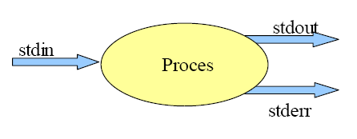
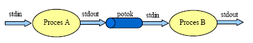

# Filtry, strumienie oraz przetwarzanie potokowe

## Standardowe wejście/wyjście
Każdy proces domyślnie korzysta ze standardowych strumieni danych, będących abstrakcją źródła lub ujścia danych. Dla każdego procesu system tworzy standardowy strumień wejściowy (ang. *standard input*), reprezentujący urządzenia wejściowe, np. klawiaturę i dysk, standardowy strumień wyjściowy (ang. *standard output*), którym może być terminal (monitor komputera) lub plik oraz strumień diagnostyczny (ang. *standard error*). Strumienie wejściowy, wyjściowy i diagnostyczny oznaczane są odpowiednio: `stdin`, `stdout`, `stderr`. Każdy strumień ma odpowiadające mu wartości: `stdin` - 0, `stdout` - 1 i `stderr` - 2.



Standardowe strumienie procesów charakteryzują się następującymi cechami:

* Dane odczytywane są poprzez standardowe wejście.
* Dane wypisywane są na standardowym wyjściu lub standardowym wejściu diagnostycznym.
* Raz przeczytanych danych nie można ponownie przeczytać.
  
Działanie standardowych strumieni ilustruje program `cat`. Uruchomienie tego programu bez argumentów powoduje przepisanie tego, co zostanie wpisane z klawiatury na ekran. Polecenie to można zakończyć za pomocą kombinacji *Ctrl-D*.

## Przekierowanie wejścia/wyjścia procesów
Istnieje możliwość przeadresowania strumieni wyjściowych i wejściowych. Zmianę standardowego wejścia, wyjścia i wyjścia diagnostycznego można dokonać za pomocą operatorów: `>`, `<`, `>>`, `<<`.

Operator `>` powoduje przeadresowanie standardowego wyjścia, czyli utworzenie pliku i zapisanie w nim tego, co proces wypisałby na standardowym wyjściu. Jeśli wskazany plik już istnieje, zostanie on usunięty i utworzony na nowo.

```bash
cat > plik.txt
To jest plik.
Ala ma kota.
^D
```
Operator `<` powoduje przeadresowanie standardowego wejścia procesu, czyli pobranie danych wejściowych ze wskazanego pliku:

```bash
cat < plik.txt
To jest plik.
Ala ma kota.
```

Operatory `>` i `<` można używać jednocześnie, przeadresowując zarówno wyjście jak i wejście, co spowoduje, że zawartość pliku `plik.txt` zostaje skopiowana do pliku `plik_nowy.txt`:

```bash
cat < plik.txt > plik_nowy.txt
```

Operator `>>` przeadresowuje standardowe wyjście, dopisując wyniki działania programu na końcu istniejącego pliku:

```bash
cat >> plik.txt
Kot ma Ale.
^D
```

Operator `<<` powoduje, że do procesu zostaną przekazane dane ze standardowego wejścia aż do napotkania wskazanego napisu:

```bash
cat <<  przerwa
> Ala ma kota
> Kot ma Ale
> przerwa
Ala ma kota
Kot ma Ale.
```

Niektóre polecenia równolegle z wyświetlanymi na standardowym wyjściu informacjami wysyłają dodatkowe informacje informujące o błędach przetwarzania na standardowe wyjście diagnostyczne. Istnieje możliwość niezależnego przekierowania strumienia diagnostycznego, poprzez operator `>` poprzedzony numerem wyjścia diagnostycznego, czyli 2:

```bash
cat plik1.txt plik2.txt 2> plik3.err
```

Polecenie to spowoduje wyświetlenie zawartości plików `plik1.txt` i `plik2.txt` oraz zapisanie informacji o błędach do pliku `plik3.err`.

W celu pominięcia komunikatów o błędach, wyjście diagnostyczne można przeadresować do pliku `/dev/null`. Wszystko co zostaje wysłane do pliku `null`, znajdującego się w katalogu `/dev` zostanie utracone:

```bash
cat plik1.txt plik2.txt> plik3.txt 2> /dev/null
```

Polecenie to spowoduje zapisanie zawartości plików `plik1.txt` i `plik2.txt` do pliku `plik3.txt` oraz jednocześnie zignoruje komunikaty o błędach.

W przypadku gdy strumień diagnostyczny ma trafiać tam, gdzie strumień wyjściowy, należy użyć zapisu `2>&1`:

```bash
cat plik1.txt plik2.txt> plik3.txt 2>&1
```

## Przetwarzanie potokowe
Standardowe wyjście jednego procesu możne być połączone ze standardowym wejściowym innego procesu, tworząc tzw. potok pomiędzy tymi procesami.



Przetwarzanie potokowe polega na buforowaniu przez system danych produkowanych przez pierwszy proces i następnie odczytywaniu tych danych przez drugi proces. Innymi słowy proces w potoku czyta dane z wejścia, które zostało przeadresowane na wyjście procesu poprzedniego. W potoku może brać udział jednocześnie kilka procesów. Poniżej podano przykłady potoków:

Proces `ls` podaje wynik procesowi `more`, który w efekcie wyświetla listing strona po stronie:
```bash
ls - al|more
```
Proces `who` podaje wynik procesowi `sort`, podając posortowaną listę pracowników pracujących w systemie:
```bash
who|sort
```
Proces `ps` podaje wynik procesowi `grep`, wyszukując na liście procesów linii zawierających słowo `csh`:
```bash
ps -ef|grep csh
```
Proces `ls` podaje wynik procesowi `sort`, który następnie podaje wynik procesowi `head`, wyświetlając pierwszych 10 najmniejszych plików:
```bash
ls -l /usr/bin|sort -bnr +4 -5|head
```
## Filtry
Istnieją programy, których zadaniem jest odczyt danych ze standardowego wejścia, przetworzenie tych danych i ich zapis na standardowe wyjście. Programy takie nazywane są filtrami i są szeroko wykorzystywane w przetwarzaniu potokowym. Poniżej przedstawiono najczęściej wykorzystywane filtry:

* `cat` - najprostszy filtr, nie wprowadzający zmian do przetwarzanych danych.     Użyteczne przełączniki:
  * `-s` z paru pustych linii robi jedna
  * `-n` numeruje wszystkie linie
  * `-b` numeruje niepuste linie
  * `-A` pokazuje znaki specjalne
* `head` - wyświetla początkową część pliku o podanej nazwie lub danych wejściowych otrzymanych z potoku gdy nazwa pliku nie jest podana. Standardowo wyświetlanych jest pierwszych 10 linii odczytanych danych. Używając przełączników liczbę tą można zmienić:
  * `-c` pozwala określić liczbę wyświetlanych znaków
  * `-n` pozwala określić liczbę wyświetlanych linii
* `tail` - wyświetla końcową część pliku o podanej nazwie lub danych wejściowych otrzymanych z potoku, gdy nazwa pliku nie jest podana,. Standardowo wyświetlanych jest ostatnich 10 linii danych. Używając przełączników liczbę tą można zmienić:
  * `-c` pozwala określić liczbę wyświetlanych znaków
  * `-n` pozwala określić liczbę wyświetlanych linii
  * `-f` powoduje, że dane po zapisaniu ich do pliku są wyświetlane na standardowym wyjściu
* `sort` - służy do sortowania danych wejściowych, które to domyślnie sortowane są leksykograficznie. Sortowanie danych odbywa się liniami. Najważniejsze przełączniki:
  * `-n` pozwala sortować numerycznie
  * `-b` ignoruje przy sortowaniu spacje znajdujące się na początku linii
  * `-t` pozwala zmienić domyślny separator kolumn, którym są znaki tabulacji lub spacji
  * `-f` pozwala ignorować przy sortowaniu wielkość liter
  * `-r` odwraca kolejność sortowania
  * `+liczba` pozwala by sortowanie odbywało się względem dowolnej kolumny (a nie początku linii). Liczba określa liczbę kolumn pominiętych przy sortowaniu
  * `-o nazwa_pliku` zapisuje rezultat sortowania do pliku o podanej nazwie
* `uniq` - umożliwia usunięcie powtarzających się, sąsiadujących linii danych wejściowych.
  * `-d` wyświetla z danych wejściowych tylko linie powtarzające się
  * `-u` wyświetla z danych wejściowych tylko linie unikalne
  * `-c` zlicza liczbę powtórzeń
* `wc` - zlicza znaki, słowa i linie w podanych danych wejściowych. Standardowo wyświetlane są wszystkie trzy wartości, ale można to zmienić:
  * `-l` pozwala zliczać tylko linie
  * `-w` pozwala zliczać tylko słowa
  * `-c` pozwala zliczać tylko znaki
* `tr` - pozwala zamienić łańcuchy tekstowe, które podawane są jako argumenty wejściowe. Znaki z pierwszego łańcuch zamieniane są na znaki z drugiego łańcucha. Dodatkowo, dzięki przełącznikom możliwe jest następujące przetwarzanie:
  * `-d` usuwa podane po przełączniku znaki
  * `-s` usuwa powtarzające się sąsiednie znaki
* `cut` - pozwala wyświetlić fragmenty wierszy danych wejściowych. Zwykle jest to wycinanie odpowiednich kolumn.- pozwala wyświetlić fragmenty wierszy danych wejściowych. Zwykle jest to wycinanie odpowiednich kolumn.
  * `-c` pozwala określić pozycję znakowe wycinanych fragmentów wierszy, np. `-c 1-72` wyświetla pierwsze 72 znaki każdego wiersza
  * `-f` pozwala określić numery wycinanych kolumn, np. `-f1,3-5,10` wyświetla pierwszą kolumnę, kolumny od 3 do 5 oraz kolumnę 10.
  * `-d` pozwala zmienić domyślny separator kolumn, którym jest znak tabulacji
* `grep [opcje] wyrażenie [lista_plików]` - przeszukuje dane pochodzące ze standardowego wejścia lub pliki wyszczególnione na liście plików, wypisując tylko linie zawierające szukane wyrażenie. Szukane wyrażenie zapisywane jest za pomocą wyrażenia regularnego. Najważniejsze przełączniki:
  * `-v` wyszukuje linie nie zawierające szukanego wzorca
  * `-c` podaje liczbę odszukanych wyrażeń
  * `-i` ignoruje wielkość liter przy wyszukiwaniu
  * `-n` wyświetla numery linii zawierających dany wzorzec
  * `-h` przy wyświetlaniu linii zawierających szukany wzorzec pomija nazwy plików
  * `-r` pozwala na przeszukiwanie rekurencyjne, np. grep wzorzec -r katalog
  * `-l` pokazuje nazwy plików zawierających określony wzorzec
  * `-L` pokazuje nazwy plików nie zawierających określonego wzorca

Zasady konstrukcji podstawowych wyrażeń regularnych opisujących szukany wzorzec są następujące:
* `.` - reprezentuje dowolny znak
* `[abc]` - oznacza jeden ze znaków a, b lub c
* `[a-z]` - oznacza jeden ze znaków z podanego zbioru
* `[^0-9]` - oznacza dopełnienie podanego zbioru
* `.*` - oznacza dowolny ciąg znaków
* `*` - reprezentuje powtórzenie dowolną liczbę razy wyrażenia znajdującego się bezpośrednio po lewej stronie np. `A[a]*` określa A, Aa, Aaa, Aaaaaaaaa, itd.
* `^` - reprezentuje początek linii
* `$` - reprezentuje koniec linii
* `a\{n\}` - oznacza n-krotne wystąpienie znaku występującego bezpośrednio po lewej stronie nawiasów
* `a\{n, \}` - oznacza co najmniej n-krotne wystąpienie znaku występującego bezpośrednio po lewej stronie nawiasów
* `a\{, m\}` - oznacza co najwyżej m-krotne wystąpienie znaku występującego po lewej stronie nawiasów
* `a\{n,m\}` - oznacza co najmniej n-krotne i co najwyżej m-krotne wystąpienie znaku występującego po lewej stronie nawiasów

Dodatkowo istnieje specjalna grupa znaków mająca znaczenie specjalne. Do znaków tych należą: `. * {} () ^ [ ] \ < > $`. W celu wykorzystania tych znaków jako zwykłych znaków, należy je poprzedzić znakiem `\`. Oprócz podstawowych wyrażeń regularnych istnieją wyrażenia rozszerzone, pozwalające w krótszy sposób opisać poszukiwane wyrażenie i oferujące bogatsze możliwości opisu wyrażeń. W celu użycia rozszerzonych wyrażeń regularnych, należy polecenie grep użyć z przełącznikiem `-E`, lub wykorzystać polecenie `egrep`.

## Zadania do samodzielnego wykonania
1. Wyświetl plik */etc/passwd* z podziałem na strony przyjmując, że strona ma 5 linii tekstu. W oknie terminala wyświetlaj w danej chwili tylko jedną stronę tekstu.
2. Korzystając z polecenia `cat` utwórz plik *tekst3*, który będzie składał się z zawartości pliku *tekst1*, ciągu znaków podanego ze standardowego wejścia (klawiatury) i pliku *tekst2*.
3. Wyświetl po 5 pierwszych linii wszystkich plików w swoim katalogu domowym w taki sposób, aby nie były wyświetlane ich nazwy.
4. Wyświetl linie o numerach 3, 4 i 5 z pliku */etc/passwd*
5. Wyświetl linie o numerach 5, 6 i 7 od końca pliku */etc/passwd*
6. Wyświetl zawartość */etc/passwd* w jednej linii
7. Za pomocą filtru `tr` wykonaj modyfikację pliku, polegającą na umieszczeniu każdego słowa w osobnej linii.
8. Zlicz wszystkie pliki znajdujące się w katalogu */etc* i jego podkatalogach
9. Napisać polecenie zliczające sumę znaków z pierwszych trzech linii pliku */etc/passwd*
10. Wyświetl listę plików z aktualnego katalogu, zamieniając wszystkie małe litery na duże.
11. Wyświetl listę praw dostępu do plików w aktualnym katalogu, ich rozmiar i nazwę
12. Wyświetl listę plików w aktualnym katalogu, posortowaną według rozmiaru pliku
13. Wyświetl zawartość pliku */etc/passwd* posortowaną wg numerów *UID* w kolejności od największego do najmniejszego
14. Wyświetl zawartość pliku */etc/passwd* posortowaną najpierw wg numerów *GID* w kolejności od największego do najmniejszego, a następnie *UID*
15. Podaj liczbę plików każdego użytkownika
16. Sporządź statystykę praw dostępu (dla każdego z praw dostępu podaj ile razy zostało ono przydzielone)
17. Podaj nazwy trzech najmniejszych plików w katalogu posortowane wg nazwy
18. Podaj pięciu użytkowników o największej liczbie uruchomionych procesów
19. Wyświetl zawartość 3 największych podkatalogów katalogu bieżącego
20. Wyświetl nazwy tych użytkowników, którzy domyślnie używają innego interpretera niż *bash*
21. Wyświetl nazwy wszystkich plików nagłówkowych posortowane wykorzystywanych w plikach bieżącego katalogu
22. Wyświetl statystykę używanych komend (bez argumentów) w postaci posortowanej listy: ilość komenda ( wskazówka: należy użyć polecenia *history*)
23. W podanym katalogu utwórz podkatalogi wszystkim użytkownikom ze swojego roku i dodatkowo zapisz w pliku o nazwie users.txt posortowaną listę tych użytkowników.
