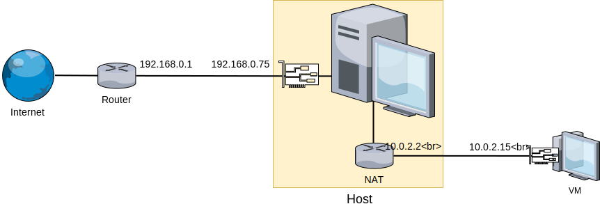
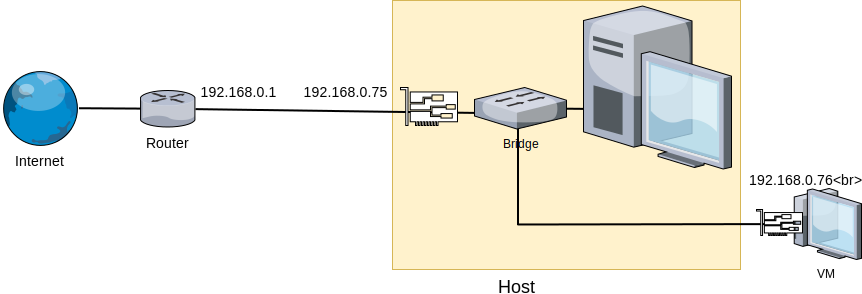
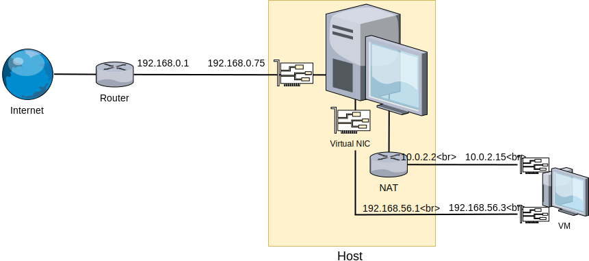
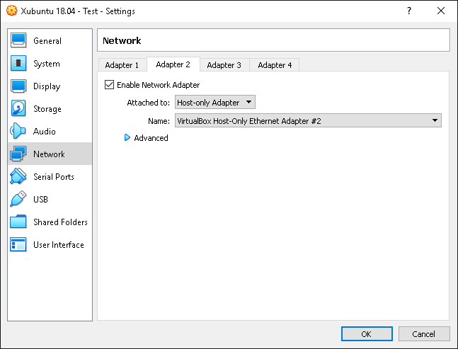
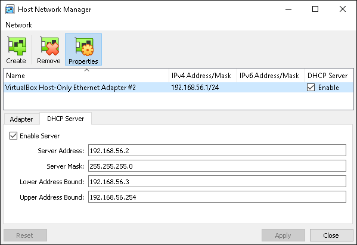

# Konfiguracja sieci, SSH

## Architektura sieci w VirtualBox

Domyślna konfiguracja sieci pod VirtualBox (NAT) sprawdza się, kiedy potrzebny jest dostęp z poziomu maszyny wirtualnej do Internetu lub do sieci, do której podłączony jest host. VirtualBox tworzy "wirtualny router" pomiędzy hostem a maszyną goszczoną, przez co z poziomu fizycznej sieci widziane są one jako jedno urządzenie:



Do pełnej komunikacji sieciowej pomiędzy systemem goszczonym a hostem, konieczna będzie modyfikacja ustawień sieciowych. Możliwe są dwa rozwiązania:

* **Mostek sieciowy (ang. *bridge*) z fizycznym interfejsem** - karta sieciowa maszyny wirtualnej zostaje połączona przez "wirtualny switch" z siecią fizyczną. Router przydziela maszynie wirtualnej IP z tej samej puli, wszystkie urządzenia w danej podsieci widzą maszynę wirtualną jako dodatkowy komputer w sieci:



* **Dodatkowe połączenie host-only** - dodatkowa sieć łącząca maszynę wirtualną z hostem, poprzez wirtualną kartę sieciową, równolegle z kartą połączoną przez NAT (dla zachowania dostępu do Internetu). Umożliwia to pełną komunikację host-guest, nie wystawiając dostępu do gościa "na zewnątrz":



## Konfiguracja połączenia sieciowego

W ramach zajęć będziemy posługiwać się dodatkowym połączeniem **host-only**, tak aby maszyny wirtualne nie były ogólnodostępne z sieci Politechniki.

Wyłącz maszynę wirtualną i wejdź w jej ustawienia, w zakładkę *Network*. Pozostaw *Adapter 1* bez zmian, natomiast w karcie *Adapter 2* włącz interfejs i ustaw go jako podpięty do *Host-only Adapter*. Domyślnie w systemie jest jedna karta sieciowa *VirtualBox Host-Only Ethernet Adapter* i powinna zostać wybrana:



Dodatkowo należy skonfigurować sieć *Host-Only*. W oknie głównym VirtualBox, z menu *File* wybierz opcję *Host Network Manager...*. Podświetl interfejs *VirtualBox Host-Only* i skonfiguruj jego adres IP oraz włącz serwer DHCP:



---

W większości przypadków (np. w sieci domowej) praktyczniejsze jest rozwiązanie z **mostkiem**. Konfiguracja sprowadza się do przełączenia w VirtualBoxie interfejsu sieciowego maszyny wirtualnej w tryb *Bridged Adapter* i wskazania odpowiedniej fizycznej karty sieciowej:


**Ważne**: jak wspomniano w opisie architektury sieci, router do którego podłączona jest maszyna wirtualna przez zmostkowany interfejs będzie widział dwa urządzenia. Niektóre sieci, zwłaszcza bezprzewodowe, blokują możliwość mostkowania połączenia (np. w sieci *eduroam* połączenie dwóch urządzeń jednocześnie może spowodować blokadę dostępu dla certyfikatu użytkownika).

---

## Test połączenia sieciowego, polecenie `ip`

Po skonfigurowaniu sieci zgodnie z powyższym opisem uruchom maszynę. Stan interfejsów sieciowych pod *XFCE* możesz sprawdzić korzystając z apletu *NetworkManager*. Naciśnij ikonę  i wybierz *Connection Information*. Powinny widoczne być dwa interfejsy:

* podłączony do NAT, z adresem z puli *10.0.2.\** i przydzieloną domyślną bramą i serwerem DNS
* podłączony do sieci *Host-Only*, z adresem z puli *192.168.56.\**

W teminalu możesz sprawdzić połączenie z internetem:

```bash
ping -c 1 google.com
```

oraz z hostem:

```bash
ping -c 1 192.168.56.1
```

Warto sprawdzić również komunikację w przeciwną stronę - uruchom terminal pod systemem Windows: w okienku dialogowym *Uruchom*/*Run* (skrót klawiszowy **Win**+**R**) wpisz `cmd` i zatwierdź. Następnie w linii poleceń wpisz

```bash
ping IP
```
 gdzie `IP` to adres odpowiedniego interfejsu maszyny wirtualnej (np. *192.168.56.3*).

### Sprawdzanie interfejsów sieciowych z linii poleceń

W systemach linuksowych do konfiguracji sieci z poziomu terminala służy program `ip`. Polecenie

```bash
ip a
```

wyświetli obecne w systemie interfejsy sieciowe wraz z przypisanymi im adresami IP oraz parametrami. Poza dwoma kartami sieciowymi (o nazwach `enp*`) powinien być widoczny interfejs *lo* (*localhost*), który służy do lokalnej komunikacji przez protokoły sieciowe.

---

**Uwaga:**

Dawniej do konfiguracji interfejsów sieciowych służyło polecenie `ifconfig`, które przez swoją popularność nadal jest często wykorzystywane, jednak uznaje się je za przestarzałe.

---

## Zdalne zarządzanie przez sieć

### SSH

SSH (*secure shell*) to popularny standard protokołu komunikacyjnego pozwalający m.in. na zdalne wykonywanie poleceń przez sieć TCP/IP za pośrednictwem terminala. Połączenie jest szyfrowane i uwierzytelnione np. hasłem lub certyfikatem.

Użytkownik, przy pomocy *klienta SSH*, łączy się z akceptującym połączenia zdalne *serwerem SSH*, dzięki czemu może wykonywać z poziomu maszyny *klienta* polecenia i uruchamiać programy konsolowe na *serwerze*.

Większość dystrybucji ma domyślnie zainstalowanego klienta SSH, serwer należy często doinstalować z repozytoriów. Zainstaluj na maszynie wirtualnej serwer *OpenSSH*:

```bash
sudo apt install openssh-server
```

W aktualnym systemie Windows 10, klient SSH również jest domyślnie zainstalowany. W starszych wersjach systemu Windows można doinstalować klient i serwer w postaci *OpenSSH for Windows*, bądź wykorzystać popularny graficzny klient SSH *Putty*.
Otwórz terminal w systemie Windows i połącz się z gościem poleceniem `ssh [user@]host`, na przykład:

```bash
ssh student@192.168.56.3
```

Przy pierwszym połączeniu z danym komputerem zdalnym, klient poprosi o potwierdzenie tożsamości hosta (wpisujemy *yes*). Po poprawnym połączeniu ukaże się znak zachęty taki, jak na komputerze, z którym się łączymy. Sesję kończymy poleceniem `exit`.

Przydatne zaawansowane przełączniki klienta SSH:

* `-p port` - zmienia docelowy port (domyślnie 22)
* `-L port_lokalny_klienta:host:port_zdalny` - *local port forwarding*, tuneluje `port_lokalny_klienta` z klienta SSH na `port_zdalny` serwera `host` przez serwer SSH
* `-R port_lokalny_serwera:host:port_zdalny` - *remote port forwarding*, tuneluje `port_lokalny_serwera` z serwera SSH na `port_zdalny` komputera `host` przez klienta SSH
* `-D port` - *dynamic port forwarding* - otwiera proxy SOCKS na porcie `port` klienta

Przekierowywanie portów (tunelowanie) SSH pozwala m.in. przesyłać dane po bezpiecznym, szyfrowanym połączeniu, ominąć ograniczenia sieciowe w postaci zablokowanych portów lub uruchomić prosty serwer proxy dla przeglądarki WWW.

### `scp`

Częścią pakietu OpenSSH są programy `scp` oraz `sftp`, wykorzystujące protokół SSH do zdalnej wymiany plików.

Program `scp` pozwala na kopiowanie plików z/na zdalny komputer, na którym uruchomiony jest serwer SSH, w analogiczny sposób do programu `cp`:

```bash
scp source destination
```
Zarówno `source` jak i `destination` mogą być lokalnymi ścieżkami do pliku lub ścieżką do pliku na serwerze SSH w postaci `[user@]host:[path]`.

Przykładowe wywołania:

Kopiowanie pliku na zdalny komputer, do katalogu domowego:
```bash
scp dane.txt student@192.168.56.3:/home/student
```

Kopiowanie pliku ze zdalnego komputera
```bash
scp student@192.168.56.3:/etc/resolv.conf resolv.conf
```

---

#### Zadania do samodzielnego wykonania

Korzystając z połączenia SSH (*serwer* oznacza w tym przypadku maszynę goszczoną):

1. Wyświetl interfejsy sieciowe serwera.
2. Wyświetl procesy o największym użyciu procesora.
3. Utwórz na hoście (w Notatniku) plik tekstowy zawierający kilka linijek tekstu i prześlij go do serwera. Wyświetl go w zdalnej konsoli.
4. Skopiuj z serwera wszystkie pliki z rozszerzeniem `.conf` znajdujące się w katalogu `/etc`.

---

### screen

Programy uruchomione w sesji terminala są przerywane w momencie zamknięcia sesji (np. zamknięcia terminala lub połączenia SSH). W przypadku połączenia SSH, jeśli połączenie zostanie przerwane np. przez błędy w działaniu sieci, program uruchomiony w takiej sesji również zostanie zakończony.

Czasami następuje konieczność uruchomienia czasochłonnego programu i pozostawienia go uruchomionego na serwerze, w czym pomogą nam wirtualne konsole. Najpopularniejsze programy umożliwiające tworzenie wirtualnych konsol to *screen* oraz *tmux*, podczas zajęć będziemy posługiwali się poleceniem *screen*.

Uruchomienie programu `screen` bez argumentów spowoduje utworzenie nowej sesji i przejście do niej. *screen* zmienia nieco działanie konsoli - niemożliwe staje się m.in. przewijanie graficznego terminala. Odłączenie (ang. *detach*) sesji i pozostawienie jej uruchomionej w tle wymaga naciśnięcia sekwencji **Ctrl-A**, **Ctrl-D**. Zakończenie sesji z jej poziomu możliwe jest poleceniem `exit`.

Przydatne przełączniki:

* `-S name` - tworzy sesję o nazwie `name`
* `-ls` - wypisuje listę bieżących sesji
* `-r` - podłącza się do sesji o nazwie `name`
* `-R` - podłącza się do ostatnio odłączonej sesji

---

#### Zadania do samodzielnego wykonania

5. Zainstaluj program *screen*.
6. Z poziomu graficznego terminala pod systemem gościa utwórz sesję *screen* o nazwie *i_has_internet*.
7. Wewnątrz sesji uruchom *ping* do serwera *google.com*.
8. Odłącz się od sesji i zamknij terminal.
9. Zaloguj się z systemu hosta przez SSH.
10. Wyświetl listę sesji *screen*.
11. Połącz się ponownie do sesji *i_has_internet*.
12. Przerwij działanie programu *ping*.
13. Zakończ sesję *screen*.
14. Wyświetl listę sesji *screen*.
15. Zakończ połączenie SSH.

---

### Edytory tekstu nano, vim

W pracy z systemami, które nie posiadają środowiska graficznego lub zdalnej pracy przez SSH często zachodzi konieczność edycji plików tekstowych z poziomu terminala. Sprawna edycja plików tekstowych możliwa jest dzięki konsolowym edytorom takim jak *Emacs*, *Vim* czy *Nano*.

Osoby posługujące się takimi edytorami na co dzień znają mnóstwo skrótów i trików, które powodują, że praca z takim programem może być sprawniejsza niż z edytorem graficznym.

Na potrzeby sporadycznej edycji plików, np. konfiguracyjnych, najprostszy w użyciu jest program *Nano*. Oferuje on quasi-graficzny interfejs z podpowiedziami skrótów klawiszowych.

Przykładowe użycie (jeśli plik nie istnieje, zostanie utworzony):

```bash
nano plik.txt
```

Najważniejsze skróty:
* **Ctrl-o** - zapisz
* **Ctrl-x** - wyjdź
* **Ctrl-k** - wytnij tekst (domyślnie bieżąca linia)
* **Ctrl-u** - wklej tekst

W przypadku konieczności edycji pliku pod systemem, gdzie program *Nano* jest niedostępny (i nie chcemy lub nie możemy go zainstalować), istnieje bardzo duża szansa, że zainstalowany jest program *Vim*.

Przykładowe użycie (jeśli plik nie istnieje, zostanie utworzony):

```bash
vim plik.txt
```

Najważniejsze skróty klawiszowe:

`i` - przechodzi w tryb edycji, pozwala na wprowadzenie tekstu
`Esc` - wychodzi z trybu edycji lub przerywa wpisywanie komendy

Komendy (zatwierdzane enterem):

* `:w` - zapisz
* `:q` - wyjdź
* `:q!` - wyjdź bez zapisywania
* `:x` - zapisz i wyjdź

---

#### Zadania do samodzielnego wykonania

16. Korzystając z *Nano* zwiększ rozmiar przechowywanej historii *bash* (wartość `HISTSIZE` w pliku `.bashrc` w katalogu domowym)
17. Korzystając z *Vim*-a wyedytuj dowolny plik tekstowy.

***
Autor: *Jakub Tomczyński*

Data ostatniej modyfikacji:   *28-03-2019*
