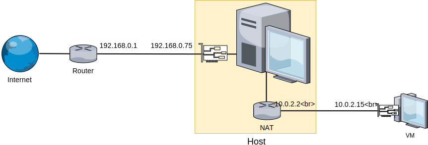
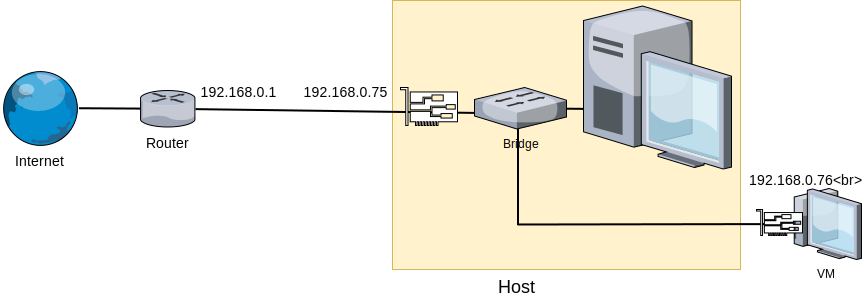
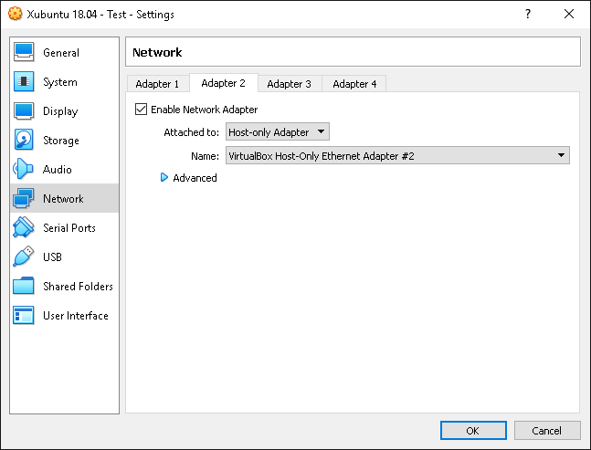
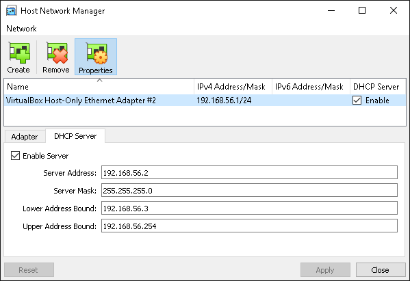

# Konfiguracja sieci, SSH, partycje

## Architektura sieci w VirtualBox

Domyślna konfiguracja sieci pod VirtualBox (NAT) sprawdza się, kiedy potrzebny jest dostęp z poziomu maszyny wirtualnej do Internetu lub do sieci, do której podłączony jest host. VirtualBox tworzy "wirtualny router" pomiędzy hostem a maszyną goszczoną, przez co z poziomu fizycznej sieci widziane są one jako jedno urządzenie:



Do pełnej komunikacji sieciowej pomiędzy systemem goszczonym a hostem, konieczna będzie modyfikacja ustawień sieciowych. Możliwe są dwa rozwiązania:

* **Mostek sieciowy (ang. *bridge*) z fizycznym interfejsem** - karta sieciowa maszyny wirtualnej zostaje połączona przez "wirtualny switch" z siecią fizyczną. Router przydziela maszynie wirtualnej IP z tej samej puli, wszystkie urządzenia w danej podsieci widzą maszynę wirtualną jako dodatkowy komputer w sieci:



* **Dodatkowe połączenie host-only** - dodatkowa sieć łącząca maszynę wirtualną z hostem, poprzez wirtualną kartę sieciową, równolegle z kartą połączoną przez NAT (dla zachowania dostępu do Internetu). Umożliwia to pełną komunikację host-guest, nie wystawiając dostępu do gościa "na zewnątrz":


## Konfiguracja połączenia sieciowego

W ramach zajęć będziemy posługiwać się dodatkowym połączeniem **host-only**, tak aby maszyny wirtualne nie były dostępne z sieci Politechniki.

Wyłącz maszynę wirtualną i wejdź w jej ustawienia, w zakładkę *Network*. Pozostaw *Adapter 1* bez zmian, natomiast w karcie *Adapter 2* włącz interfejs i ustaw go jako podpięty do *Host-only Adapter*. Domyślnie w systemie jest jedna karta sieciowa *VirtualBox Host-Only Ethernet Adapter* i powinna zostać wybrana:



Dodatkowo należy skonfigurować sieć *Host-Only*. W oknie głównym VirtualBox, z menu *File* wybierz opcję *Host Network Manager...*. Podświetl interfejs *VirtualBox Host-Only* i skonfiguruj jego adres IP oraz włącz serwer DHCP:



---

W większości przypadków (np. w sieci domowej) praktyczniejsze jest rozwiązanie z **mostkiem**. Konfiguracja sprowadza się do przełączenia w VirtualBoxie interfejsu sieciowego maszyny wirtualnej w tryb *Bridged Adapter* i wskazania odpowiedniej fizycznej karty sieciowej:


**Ważne**: jak wspomniano w opisie architektury sieci, router do którego podłączona jest maszyna wirtualna przez zmostkowany interfejs będzie widział dwa urządzenia. Niektóre sieci, zwłaszcza bezprzewodowe, blokują możliwość mostkowania połączenia (np. w sieci *eduroam* połączenie dwóch urządzeń jednocześnie może spowodować blokadę dostępu dla certyfikatu użytkownika).

---

## Test połączenia sieciowego, polecenie `ip`

Po skonfigurowaniu sieci zgodnie z powyższym opisem uruchom maszynę. Stan interfejsów sieciowych pod *XFCE* możesz sprawdzić korzystając z apletu *NetworkManager*. Naciśnij ikonę  i wybierz *Connection Information*. Powinny widoczne być dwa interfejsy:

* podłączony do NAT, z adresem z puli *10.0.2.\** i przydzieloną domyślną bramą i serwerem DNS
* podłączony do sieci *Host-Only*, z adresem z puli *192.168.56.\**

W teminalu możesz sprawdzić połączenie z internetem:

```bash
ping -c 1 google.com
```

oraz z hostem:

```bash
ping -c 1 192.168.56.1
```

Warto sprawdzić również komunikację w przeciwną stronę - uruchom terminal pod systemem Windows: w okienku dialogowym *Uruchom*/*Run* (skrót klawiszowy **Win**+**R**) wpisz `cmd` i zatwierdź. Następnie w linii poleceń wpisz

```bash
ping IP
```
 gdzie `IP` to adres odpowiedniego interfejsu maszyny wirtualnej (np. *192.168.56.3*).

### Sprawdzanie interfejsów sieciowych z linii poleceń

W systemach linuksowych do konfiguracji sieci z poziomu terminala służy program `ip`. Polecenie

```bash
ip a
```

wyświetli obecne w systemie interfejsy sieciowe wraz z przypisanymi im adresami IP oraz parametrami. Poza dwoma kartami sieciowymi (o nazwach `enp*`) powinien być widoczny interfejs *lo* (*localhost*), który służy do lokalnej komunikacji przez protokoły sieciowe.

---

**Uwaga:**

Dawniej do konfiguracji interfejsów sieciowych służyło polecenie `ifconfig`, które przez swoją popularność nadal jest szeroko wykorzystywane, jednak uznaje się je za przestarzałe.

---

## Zdalne zarządzanie przez sieć

### SSH

SSH (*secure shell*) to popularny standard protokołu komunikacyjnego pozwalający m.in. na zdalne wykonywanie poleceń przez sieć TCP/IP za pośrednictwem terminala. Połączenie jest szyfrowane i uwierzytelnione np. hasłem lub certyfikatem.

Użytkownik, przy pomocy *klienta SSH*, łączy się z akceptującym połączenia zdalne *serwerem SSH*, dzięki czemu może wykonywać z poziomu maszyny *klienta* polecenia i uruchamiać programy konsolowe na *serwerze*.

Większość dystrybucji ma domyślnie zainstalowanego klienta SSH, serwer należy często doinstalować z repozytoriów. Zainstaluj na maszynie wirtualnej serwer *OpenSSH*:

```bash
sudo apt install openssh-server
```

W systemie


### screen

Programy uruchomione w sesji terminala są przerywane w momencie zamknięcia sesji (np. zamknięcia terminala lub połączenia SSH). W przypadku połączenia SSH, jeśli połączenie zostanie przerwane np. przez błędy w działaniu sieci, program uruchomiony w takiej sesji również zostanie zakończony.

Czasami następuje konieczność uruchomienia czasochłonnego programu i pozostawienia go uruchomionego na serwerze, w czym pomogą nam wirtualne konsole. Najpopularniejsze programy umożliwiające tworzenie wirtualnych konsol to *screen* oraz *tmux*, podczas zajęć będziemy posługiwali się poleceniem *screen*.
