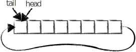

# Programowanie współbieżne - współdzielenie zasobów, semafory, ciąg dalszy

## Bufor cykliczny

Rozwiązaniem pozwalającym na poprawną wymianę danych pomiędzy jednym producentem i jednym konsumentem, jest bufor cykliczny (zwany też kołowym).

Bufor cykliczny wykorzystuje stałą (o stałej długości i położeniu w pamięci) tablicę, która w praktyce jest buforem bez początku i końca - po ostatnim elemencie następuje przeskok na element pierwszy. W celu określenia, w które miejsce powinny zostać zapisywane dane, a z którego odczytywane, wykorzystuje się dwie dodatkowe zmienne (indeksy miejsc lub wskaźniki na miejsca). Wskaźnik zapisu (*head*) opisuje miejsce, w które powinny zostać zapisane dane, jeśli nadejdą. Wskaźnik odczytu (*tail*) opisuje miejsce, z którego powinny zostać odczytane dane, jeśli nastąpi takie żądanie. Każda operacja zapisu/odczytu powoduje przesunięcie odpowiedniego wskaźnika o 1 w przód. Kiedy *tail* „dogoni” *head* bufor jest pusty, a kiedy head dogoni tail, bufor jest pełny i dalszy zapis jest niemożliwy.

Ponieważ oba wskaźniki są modyfikowane tylko przez jeden proces, możliwa jest implementacja dla przypadku z jednym producentem i jednym konsumentem bez wykorzystania muteksów. Rozwiązanie to jest bardzo efektywne i często wykorzystywane w mikrokontrolerach i systemach wbudowanych.

Przykładowe stany bufora cyklicznego:

* Stan początkowy, bufor pusty:



* Dodano 5 elementów:


* Pobrano 2 elementy, 3 zostały w buforze:


* Dodano 4 elementy, bufor pełny:


### Zadanie 1: bufor cykliczny

Napisz program analogiczny do **Zadania 2a** z poprzednich zajęć tak, aby wykorzystywał bufor cykliczny.

## Zmienne warunkowe

Zmienne warunkowe (ang. *condition variables*) są jednym ze sposobów na synchronizację pomiędzy wątkami. Pozwalają na przysłanie sygnału z jednego wątku do pozostałych, które mogą na niego oczekiwać (np. sygnał o nadejściu danych, zwolnieniu bufora itp.). Dzięki temu nie jest konieczne np. okresowe sprawdzanie w pętli danego warunku, co mogłoby zwiększać czas reakcji na wystąpienie warunku lub powodować niepotrzebne użycie procesora. Zmienne warunkowe w C++11 są dostępne pod postacią klasy `std::condition_variable` po załączeniu nagłówka `<condition_variable>`. Zmienna warunkowa używana jest zawsze w połączeniu z muteksem oraz obiektem `std::unique_lock`, który zarządza blokadą muteksu. Oczekiwanie na sygnał od zmiennej warunkowej (dodanie wątku do kolejki oczekujących) rozpoczynamy metodą `wait()`. Pozostałe wątki korzystające z danej zmiennej warunkowej mogą powiadomić jeden z kolejki oczekujących wątków metodą `notify_one()` lub wszystkie oczekujące metodą `notify_all()`. Przykładowe użycie zmiennej warunkowej pokazano na poniżej:

```cpp
std::condition_variable cv; // zmienna warunkowa
std::mutex cv_mtx;          // mutex chroniacy zmienna warunkowa oraz stan
int state = 0;               // zmienna przekazujaca informacje o stanie

void do_work() {
    for (int i = 1; i <= 5; i++) {
        std::this_thread::sleep_for(std::chrono::seconds(1));
        {
            std::unique_lock<std::mutex> lock(cv_mtx);
            // tworzy blokade na muteksie
            state = i; // zmien stan
        } // koniec scope - obiekt lock zostaje zniszczony -
        // nastepuje automatyczne zwolnienie muteksu
        cv.notify_all(); // powiadom wszystkie watki oczekujace w cv.wait()
    }
}

int main (){
    std::unique_lock<std::mutex> lock(cv_mtx); // tworzy blokade na muteksie
    std::thread work_thread(do_work);
    while(state != 5) {
        cv.wait(lock); // zdejmuje blokade, czeka na powiadomienie
        // po nadejsciu powiadomienia ponownie zaklada blokade
        std::cout << state << std::endl;
    }
    work_thread.join();
    return 0;
}
```

**Uwaga!** Wyjście z metody `wait()` nie musi oznaczać sygnału od innego wątku - w programie mogą wystąpić spontaniczne wybudzenia wątków (ang. *spurious wakeups*), stąd faktyczne źródło wybudzenia należy zweryfikować np. korzystając z dodatkowej zmiennej (tutaj: `state`).

### Zadanie 2

W pewnym systemie występuje wiele czujników zwracających dane w nieregularnych odstępach czasu. Napisz program, który będzie cyklicznie pobierał dane ze wszystkich czujników, a po uzbieraniu w buforze 5 wartości, wypisywał dane na ekranie w postaci:

```
New data!: ID:wartosc ID:wartosc ID:wartosc ID:wartosc ID:wartosc
```

Użytkownik wprowadza liczbę czujników *n* przy uruchomieniu programu, a ID przyjmują wartości od 0 do *n*-1.

Do powiadamiania wątku realizującego wyświetlanie o nowych danych wykorzystaj zmienną warunkową. Komunikację z czujnikiem oraz odczyt danych symuluj dostarczoną funkcją double `read_sensor(int id)`:

```cpp


```


***
Autor: *Jakub Tomczyński*

Data ostatniej modyfikacji: {JUG:MODIFICATION_DATE}
